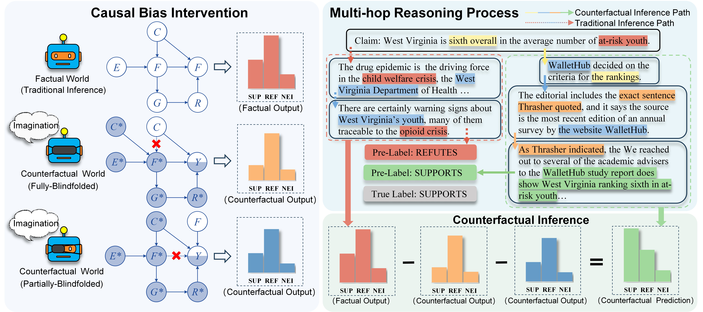

# Causal Debiasing for Multi-hop Fact Verification
## CMFV Framework

## 📦 Download

To reproduce the results in the paper, please download our pre-trained models from [this shared folder](https://drive.google.com/drive/folders/1gU_92qYOAVcifI2H8bcxBzf4VPZtPINc?usp=sharing).

Then organize them in the following structure:

```
CMFV
├── data
├── pretrained_models
├── outputs
├── data_load_utils.py
├── models.py
├── train_fever_2class.py
├── train_politihop_2class.py
├── train_politihop_3class.py
├── train.sh
└── utils.py
```
## 🛠️ Environment

Our experiments are conducted using PyTorch 2.0.0 on a single NVIDIA RTX 4090 GPU (24 GB). 
Install dependencies with:
```bash
pip install torch==2.0.0
pip install torch-geometric
pip install pytorch-pretrained-bert
pip install texar-pytorch
pip install scikit-learn
pip install pandas

